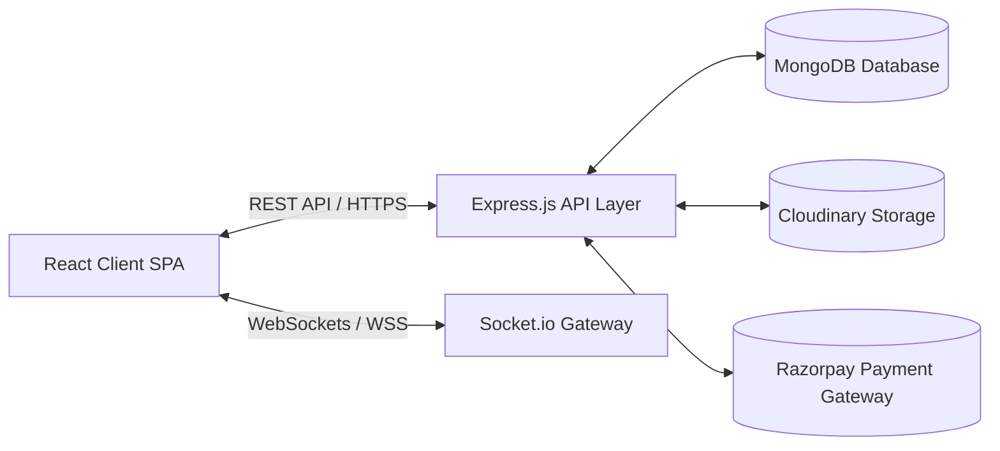

<div align="center">
  
  <p><strong>Connect Talent. Build Success.</strong></p>
  <p><em>A Portfolio-Grade MERN Marketplace Demonstrating Production-Level System Design, Real-Time WebSockets, Escrow Payments, and Modern SaaS Architecture.</em></p>
  
  <p>
    <a href="#learning-objectives"></a>
    <a href="#tech-stack"></a>
    <a href="#system-architecture"></a>
    <a href="#demo-credentials"></a>
    <a href="#license"></a>
  </p>
</div>

---

## 🎯 Educational Objective & Project Purpose

**Workstation** is designed and engineered as a comprehensive, final-year software engineering portfolio capstone. It demonstrates how modern two-sided commercial platforms (such as Upwork and Freelancer.com) solve complex engineering challenges:

1. **State-Machine Driven Workflows**: Transitioning open project posts into proposal bids, digital legal contracts, escrow fund locks, milestone deliverable reviews, and final fund releases.
2. **Dual-Token Authentication with Silent Refresh**: Eliminating session interruptions while maintaining enterprise-grade token security using short-lived memory access tokens and HTTP-only cookie rotation.
3. **Bi-Directional Real-Time Communication**: Managing private conversation channels, typing indicators, read receipts, and user presence with Socket.io handshake authentication.
4. **Third-Party FinTech Integration**: End-to-end Razorpay checkout order generation, HMAC-SHA256 signature verification, and automated invoice numbering (`WS-INV-XXXXX`).
5. **Complex MongoDB Aggregations**: Generating real-time analytics for revenue, conversion funnels, billable hours, and category distributions via Recharts.

---

## 🚀 The 6-Stage Marketplace Workflow

```
[1. Post Project] ──► [2. Discover & Search] ──► [3. Submit Proposal]
       │                                                 │
       ▼                                                 ▼
[6. Review & Payout] ◄── [5. Escrow Funding] ◄── [4. Due Diligence]
```

1. **Client Posts a Project**: Specifies scope, required skills, deadline, and fixed or hourly budget brackets.
2. **Freelancers Discover Work**: Multi-facet debounced search across 10 high-demand technical and creative domains.
3. **Proposal Submission**: Freelancers submit itemized milestone breakdowns, pricing, and personalized pitches.
4. **Review & Interview**: Clients shortlist proposals, compare verified portfolios, and chat in real time.
5. **Contract & Escrow Funding**: Accepting a bid auto-generates a contract and prompts milestone funding into escrow.
6. **Delivery & Settlement**: Freelancers submit deliverables, clients authorize release, and both exchange 5-star reviews.

---

## 🛠️ Tech Stack & Engineering Standards

| Layer | Technologies | Architectural Purpose |
|---|---|---|
| **Frontend UI** | React 18, Vite, Tailwind CSS | High-performance SPA with atomic component hierarchy and instant HMR |
| **State Management** | Redux Toolkit | Centralized state management for session auth, notifications, and active chat |
| **Routing** | React Router v7 | Protected routes, role-based guards, and React `lazy()` chunk code-splitting |
| **Motion & Design** | Framer Motion, Lucide Icons | Fluid layout transitions, glassmorphism cards, and interactive SVG graphics |
| **Data Visualization** | Recharts | Interactive Area, Bar, and Donut charts for business telemetry |
| **Forms & Validation** | React Hook Form, Zod | Client-side schema validation and performance-optimized uncontrolled inputs |
| **Backend Runtime** | Node.js, Express.js | Modular layered REST API (Routes → Controllers → Services → Models) |
| **Database** | MongoDB, Mongoose ODM | Relational schema modeling with compound unique indexes and pre-save hooks |
| **Real-Time Engine** | Socket.io | WebSocket server with JWT authorization and private room message dispatching |
| **File Storage** | Cloudinary API | Streaming multi-part buffer uploads for avatars, PDFs, and portfolio images |
| **Payments** | Razorpay SDK | Escrow milestone order creation, webhook verification, and invoice tracking |
| **Security** | Helmet, CORS, MongoSanitize | XSS prevention, rate limiting, and NoSQL query injection mitigation |

---

## 🏗️ System Architecture & Data Modeling

Full architecture documentation and interactive sequence diagrams are maintained in [`docs/ARCHITECTURE.md`](docs/ARCHITECTURE.md) and [`docs/WORKFLOWS.md`](docs/WORKFLOWS.md).



### Core Database Entities:
- **`User`**: Unified identity schema powering Freelancers, Clients, and Admins.
- **`Job`**: Project listings categorized across 10 service verticals with status progression.
- **`Proposal`**: Bids with unique index `{ job: 1, freelancer: 1 }` preventing duplicate submissions.
- **`Contract`**: Milestone-bound legal agreements tying client, freelancer, and escrow balances together.
- **`Payment`**: Audit logs of funded and released transactions with unique invoice IDs (`WS-INV-XXXXX`).
- **`Conversation` & `Message`**: Persistent chat threads with typing status and read receipts.
- **`Review`**: 5-star multi-attribute feedback updating the user's composite `ratingsAverage`.

---

## 🔑 Quickstart & Running Locally

### Prerequisites
- **Node.js**: v18.0.0 or higher
- **MongoDB**: Local MongoDB instance or free MongoDB Atlas URI

### 1. Clone & Install
```bash
git clone https://github.com/your-username/workstation.git
cd workstation

# Install dependencies across all npm workspaces (root, client, server)
npm install
```

### 2. Configure Environment Variables
Copy the example environment file into both server and client:
```bash
# Server environment
cp .env.example .env
```
Ensure minimum values are configured in `.env`:
```env
PORT=9005
NODE_ENV=development
CLIENT_URL=http://localhost:3256
VITE_API_URL=http://localhost:9005/api
MONGO_URI=mongodb://localhost:27017/workstation
JWT_ACCESS_SECRET=your_super_secret_access_key_12345
JWT_REFRESH_SECRET=your_super_secret_refresh_key_67890
```

### 3. Seed Realistic Demo Data
The built-in seeder populates the database with **61 users**, **60 projects**, **120 proposals**, active contracts, reviews, and notifications:
```bash
npm run seed
```

### 4. Run Development Server
```bash
# Concurrently starts Express API (:9005) and Vite React (:3256)
npm run dev
```
Open [http://localhost:3256](http://localhost:3256) in your browser.

---

## 👥 Demo Credentials for Evaluation

The database is pre-seeded with realistic Indian profiles across all major tech hubs (Bengaluru, Delhi, Mumbai, Hyderabad, Pune, etc.):

| Role | Email | Password | Access Highlights |
|---|---|---|---|
| **Admin** | `punittak2005@gmail.com` | `admin123` | Platform Telemetry, User & Job Moderation, Dispute Arbitration |
| **Client** | `rajesh.sharma@email.com` | `password123` | Project Posting, Proposal Review, Escrow Funding, Milestone Approval |
| **Freelancer** | `aarav.desai@email.com` | `password123` | Project Discovery, Bid Submission, Work Upload, Earnings Dashboard |

---

## 📬 Project Owner & Contact Information

For inquiries, enterprise onboarding, or technical verification:

- **Phone**: [+91 6367088841](tel:+916367088841)
- **Email**: [punittak2005@gmail.com](mailto:punittak2005@gmail.com)
- **Address**: 184 B Block, Sector 14, Hiran Magri, Udaipur, Rajasthan, India

---

## 📚 Technical Documentation Index

Detailed architectural documentation is organized in the `docs/` directory:
- 📐 [**System Architecture & Diagrams (`docs/ARCHITECTURE.md`)**](docs/ARCHITECTURE.md): High-level system architecture, complete database ER diagram, JWT authentication sequence, and Socket.io event flows.
- 🔄 [**User Workflows (`docs/WORKFLOWS.md`)**](docs/WORKFLOWS.md): Detailed journeys and flowcharts for Clients, Freelancers, and Administrators.
- 📡 [**REST API Documentation (`docs/API.md`)**](docs/API.md): Request payloads, parameter specifications, and response formats across all 12 controller modules.
- 🚀 [**Deployment Guide (`docs/DEPLOYMENT.md`)**](docs/DEPLOYMENT.md): Step-by-step production rollout guide for Vercel (Frontend) and Render/Railway (Backend).

---

## ⚖️ License & Credits

Distributed under the MIT License. Developed as a production-grade full-stack engineering capstone demonstrating modern web architecture, clean code standards, and real-world marketplace implementation.
