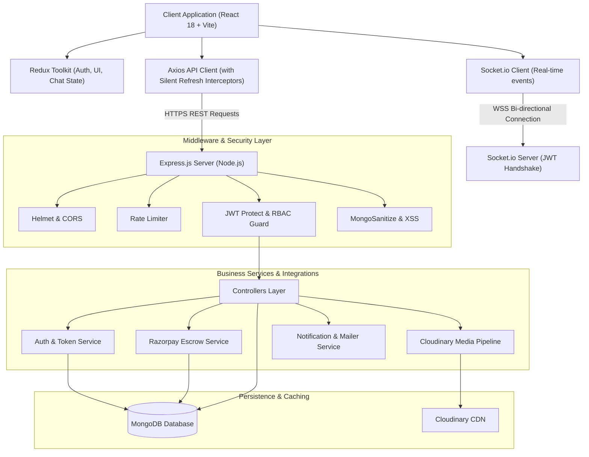
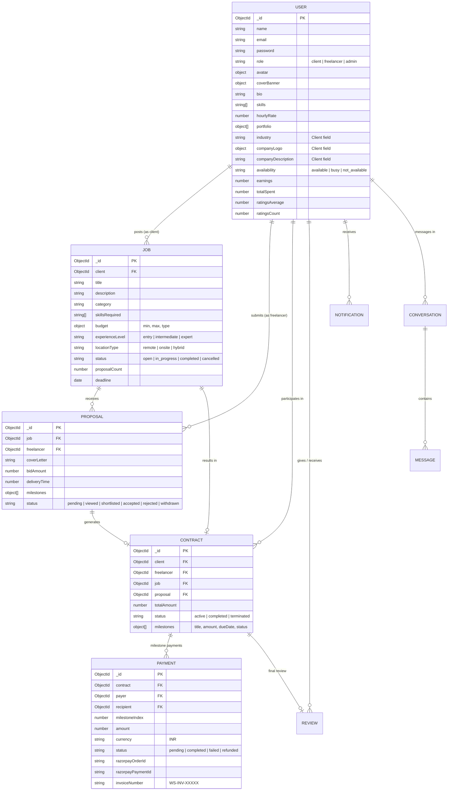
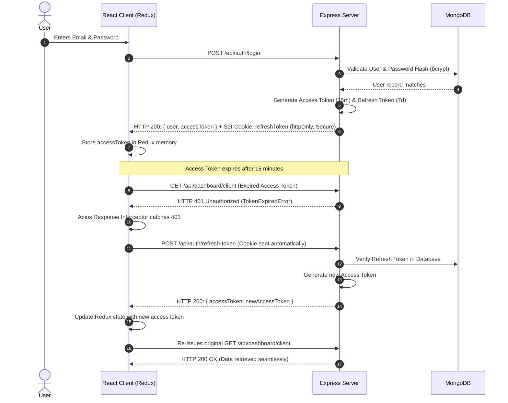
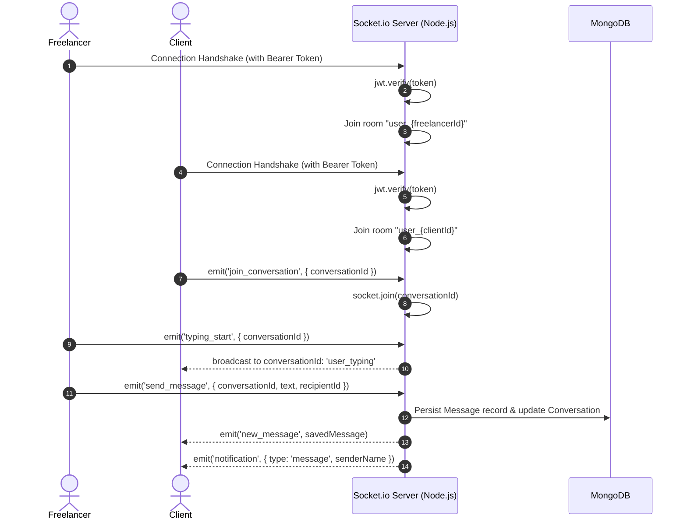
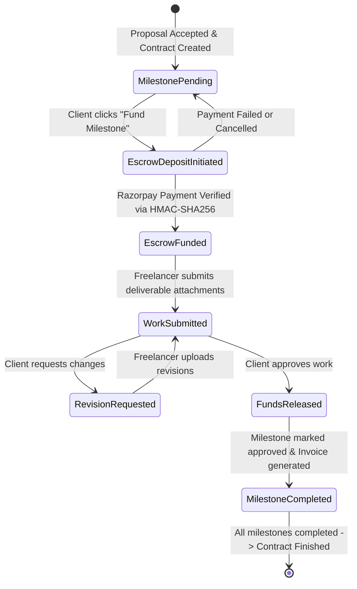

# Workstation — Technical System Architecture & Engineering Specifications

This document outlines the architectural patterns, database schemas, authentication lifecycle, WebSocket event streams, and financial state machines implemented in **Workstation**.

---

## 1. High-Level System Architecture



---

## 2. Database Entity-Relationship (ER) Diagram



---

## 3. Authentication & Silent Refresh Token Flow



---

## 4. Socket.io Real-Time Event Communication



---

## 5. Razorpay Escrow State Machine



---

## 6. Directory Structure & Layer Separation

```
Freelancing Marketplace/
├── client/                     # React Frontend (Vite + Tailwind CSS)
│   ├── public/                 # Static SVG icons and favicon assets
│   ├── src/
│   │   ├── assets/             # Images and design assets
│   │   ├── components/         # Reusable atomic UI (Button, Card, Input, Modal, etc.)
│   │   ├── context/            # React context providers (SocketContext)
│   │   ├── features/           # Domain-driven feature modules
│   │   │   ├── admin/          # Admin moderation, jobs, payments, dispute pages
│   │   │   ├── auth/           # Login, Register, OTP verify, Password reset
│   │   │   ├── chat/           # Real-time chat window, conversations list
│   │   │   ├── contracts/      # Contract view, milestone submission & release
│   │   │   ├── dashboard/      # Client, Freelancer, and Admin analytical dashboards
│   │   │   ├── freelancers/    # Freelancer directory & public profile gallery
│   │   │   ├── jobs/           # Project board, job details, and posting wizard
│   │   │   ├── landing/        # Educational showcase, workflow, categories, hero
│   │   │   ├── payments/       # Razorpay checkout, invoices, success/failed pages
│   │   │   ├── profile/        # Unified profile editor (company + freelancer info)
│   │   │   ├── proposals/      # Proposal submission modal & client review table
│   │   │   └── reviews/        # Review submission modal & rating distribution
│   │   ├── hooks/              # Custom React hooks (useAuth, useSocket, useDebounce, etc.)
│   │   ├── routes/             # AppRoutes definition with Suspense lazy loading
│   │   ├── services/           # Axios HTTP client with auto-refresh interceptors
│   │   ├── store/              # Redux Toolkit store and feature slices
│   │   └── utils/              # Formatters, constants, and Tailwind merge helpers
├── server/                     # Express.js REST API Backend
│   ├── src/
│   │   ├── config/             # DB connection, Cloudinary, and Razorpay configs
│   │   ├── constants/          # Status enums, 10 categories, and role constants
│   │   ├── controllers/        # Request handling and HTTP response dispatchers
│   │   ├── middleware/         # Auth guard, RBAC, error handler, rate limiters
│   │   ├── models/             # Mongoose schemas with indexes and hooks
│   │   ├── routes/             # REST endpoint route definitions
│   │   ├── seeder/             # Realistic demo dataset (61 users, 60 jobs, 120 proposals)
│   │   ├── services/           # Business logic (Auth, Cloudinary, Razorpay, Email)
│   │   ├── sockets/            # Socket.io connection handlers and event routers
│   │   └── utils/              # ApiError, ApiResponse, token generators, invoice formatters
└── docs/                       # Architecture, Workflows, API, and Setup Guides
```
