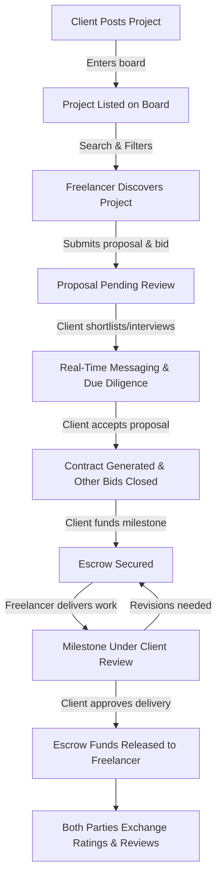
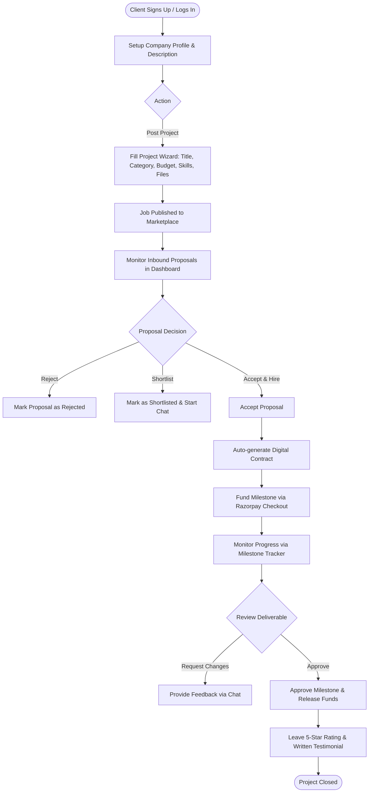
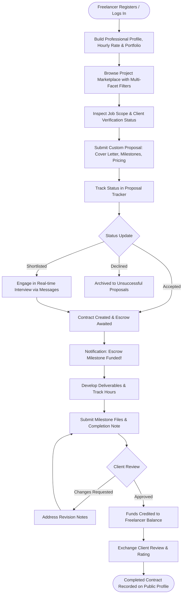
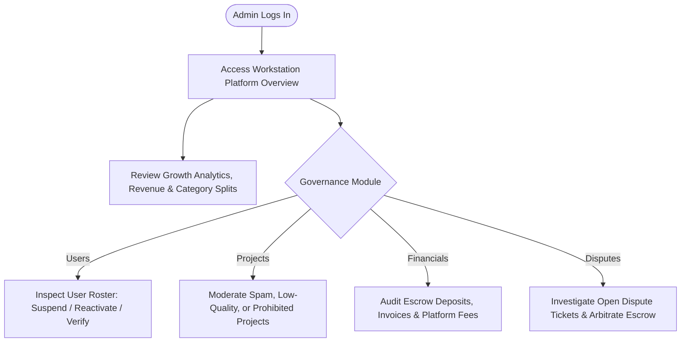

# Workstation — Marketplace Workflow & User Journey Specifications

This document outlines the detailed workflows for the three primary user roles (**Client**, **Freelancer**, **Admin**) in the **Workstation** ecosystem.

---

## 1. Complete End-to-End Marketplace Lifecycle

---

## 2. Client User Journey

### Key Client Features & Permissions:
1. **Job Management**: Create, edit, and cancel open project postings.
2. **Proposal Review Table**: Inspect candidate cover letters, milestones, ratings, and portfolio projects.
3. **Escrow Funding**: Safe financial deposits held in escrow before work commences.
4. **Milestone Tracker**: Inspect work deliverables, request adjustments, and authorize payouts.
5. **Direct Collaboration**: Access real-time chat with typing indicators and file sharing.

---

## 3. Freelancer User Journey

### Key Freelancer Features & Permissions:
1. **Dynamic Profile**: Showcase portfolio items with preview images, hourly rates, skills, education, and availability badge.
2. **Project Exploration**: Filter by 10 domains, remote vs. on-site, entry/intermediate/expert experience, and budget.
3. **Proposal Submission**: Define milestone breakdowns and custom delivery estimates.
4. **Earnings & Hours Tracking**: Analytical Recharts dashboard showing weekly earnings and billable hours.

---

## 4. Administrator Workflow & Platform Governance

### Key Admin Features & Permissions:
1. **Platform Telemetry**: Inspect total users, freelancers, clients, platform gross volume, and open disputes.
2. **User Moderation**: Suspend malicious accounts or activate verified KYC badges.
3. **Project Moderation**: Moderate spam or policy-violating job listings.
4. **Financial Oversight**: Audit Razorpay transaction IDs, escrow balances, and generated invoice records (`WS-INV-XXXXX`).
